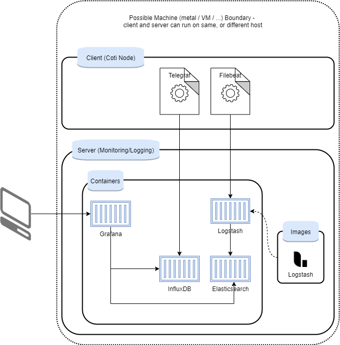

# Monitoring and logging

**Jump To**: [Usage](#usage)

Our monitoring and logging is a composition of selected open source technologies, that can help Node(s) operators to set up a basic monitoring solution easily.

This solution is basic, in the sense that we traded high availability of the monitoring system with ease of use.

In addition, we tried to keep the number of tools that we use to minimum while presenting a decent level of features needed to operate a production system.

Keeping the monitoring system as simple as possible lets individuals and companies that are not highly experienced in running such production systems to do so fast. Seasoned users can compose or build their own monitoring stack.  

## WIP
This effort is a work in progress. Please see the Limitations section. As we progress, we will support more platforms, add more features, improve user experience, and increase stability.   

## Server setup
### Prerequisites
Supported OS: Centos 7 and Ubuntu 18.04 

Following is a list of required software needed to create (and operate) the basic setup:
- Docker
- Docker-Compose
- Curl
- jq

### Auto
Requires root permissions. 

Execute setup.sh script, to install all dependencies.

We assume that curl is already installed.

```
sudo /setup.sh
```

## Architecture
The system is composed of containers, on the server-side, and agents, on the client-side, where 0..n clients can send data to the server.

We use docker-compose for running all the server's containers.

Agents run on a node, and send data that they collect, can be logs, or system metrics, to the monitoring and logging server(s).

The smallest possible setup is running all monitoring and logging on a node: both containers and agents. 

This solution looks like this:




As for the tools selection. We tried to reach a balanced environment, which is:
1. Based on battle-tested open source technologies
2. Composed of tools and technologies should well integrate 
3. Has a balanced level of modularity, in our opinion

### Containers
#### Grafana
Grafana server is the only user interface to the platform. It supports all our needs: integrate with our preferred data sources (Elasticsearch for logs, InfluxDB for time series metrics), and has a sufficient  alerting system out of the box.

#### InfluxDB
A time series database for storing system metrics data.

We use one database, with several measurements - each measurement is for a different type of data.

Tagging is used for filtering.

In case you want to use the same server for different systems, like staging and prod, it is not recommended. If you have to do that, to save compute resources, and really, there is not another possibility, and you wish to monitor more than one system, we encourage you to create additional InfluxDB container(s) and let different agents send data to their designated server.

#### Elasticsearch
A full text index for storing logs.

One index per day.

Please note our comment above regarding sending data from different environments.

#### Logstash 
Logstash is where logs are reformatted before they arrived at Elasticsearch. It is not an agent, but a "centralized" component.

### Agents
#### Telegraf
Metrics collector and shipper, the Influx way.

#### Filebeat
A file shipper, the Elastic way. Used to ship logs to Logstash.    

## Limitations
- Although the individual tools we used here run on multiple platforms, our proposed setup tested with Centos 7 and Ubuntu 18.04
-  As mentioned earlier, the system is not highly available, as we preferred simplicity. We assume that folks that can run highly available monitoring systems can easily use their own, or modify our setup scripts, so they match their requirements
- The lack of usage of containers orchestration tools, like Swarm, K8S, and similar, is a decision that will be reviewed in the near future
- Obviously, auto-scaling is also not supported in this version
- Log parser - currently, we provide a hardcoded pattern that parses the node logs. Feel free to change it at will
- Also agents can run in containers. We will revew this option for future versions

## Usage
For convenience, we created a script file that helps to build the required components for running the logging 
and monitoring server.

Pull or download this repository to your machine, and cd to its root folder. 

### prepare.sh

The first thing that you would want to do is to execute the prepare script.

Example:
```
./prepare.sh --logstash_image=coti/logstash:7.4.0.0.5 --influxdb_admin_pwd=<change_me> --influxdb_user_pwd=<change_me> \
  --docker_network=monitoring --es_java_opts="-Xms4g -Xmx4g" --grafana_admin_pwd=<change_me>
```  

Parameters:

- when marked with *, they are mandatory

| Parameter           | What / why             | default | Example                     |
| ------------------- | ---------------------- | ------- | -------                     |
| skip_setup          | When true, we will skip setup and go directly to config     | false    | true     |
| logstash_image*     | Image name and tag     | None    | coti/logstash:7.4.0.0.5     |
| influxdb_admin_pwd* | Admin pwd for InfluxDB | None    | <any string>                |
| influxdb_user_pwd*  | User pwd for InfluxDB  | None    | <any string>                |
| docker_network*     | The docker network that all containers will connect to | None | monitoring |
| es_java_opts*       | Setting ElasticSearch heap zise  | None    | "-Xms4g -Xmx4g"   |
| grafana_admin_pwd*  | admin password of grafana  | None    | <any string>   |
| grafana_admin_new_pwd | admin new password of grafana  | None    | <any string>   |
	


Please note: 
1. In case that you have special characters in the command line arguments, wrap them with double quotes (")
2. Prepare is not only starting containers, but also configure them, so if you wish to make use of the docker compose file as is, running prepare is the right way to do so 


## Client setup
The client of the logging and monitoring server is just another machine (vm, container, whatever), that 
sends data to the server.

Data is sent using 2 components:
1. Telegraf (from Influxdata)
2. Filebeat (from Elastic)   

Client setup is not based on containers. Clients are Coti nodes, that are not containerized. 

### Auto
cd to the directory.

Please note: without doing so, the setup will fail!!! (as it won't be able to locate required files)

Example:
```
sudo ./setup-client.sh --influxdb_server_address=http(s)://<influxdb_server_ip>:<server_port> --influxdb_password=<change_me> --logstash_server_address=<logstash_server_ip>:<server_port> --filebeat_logs_paths=/var/log/* --skip_setup=false
```

Parameters:

- when marked with *, they are mandatory

| Parameter           | What / why             | default | Example                     |
| ------------------- | ---------------------- | ------- | -------                     |
| skip_setup          | When true, we will skip setup and go directly to config     | false    | true     |
| influxdb_server_address | URL of InfluxDB     | http://localhost:8086    | http://10.0.0.20:8086     |
| influxdb_password*  | User pwd for InfluxDB  | None    | <any string>                |
| logstash_server_address | URL of logstash     | localhost:5044    | 10.0.0.20:5044     |
| filebeat_logs_paths* | location of logs, filebeat config cormat     | None    | ~/coti-node/logs/FullNode1*.log     |

	
Please note: logstash server ip needs to be provided without the protocol (so no "http://" part!)

## Troubleshooting
In general, this environment is not very complex, but it does include several moving parts.

Eventually, this setup is a composition of several open source projects.

Following some issues that we ran into while composing this solution; we think it may assist. 

### Strange errors on docker build

If, while running the script, you get a docker error, that starts with :

```
double free or corruption (out)
SIGABRT: abort
```

Here's a way to handle it:

https://github.com/docker/docker-credential-helpers/issues/103
```
sudo dpkg -r --force-depends golang-docker-credential-helpers
```


### InfluxDB

#### influxdb init process failed.
     
https://github.com/influxdata/influxdata-docker/issues/191

Be sure, that when you run this script, no leftovers from the past, e.g. a volume that was pre initialized, 
environment variables, etc. 

The teardown.sh script can assist - run it when you want to totally clean the docker environment. Example:

```
./teardown.sh --logstash_image=coti/logstash:7.4.0.0.5 
```
